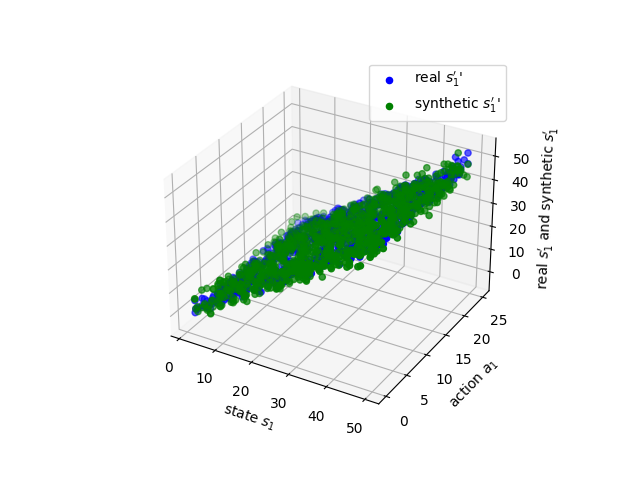
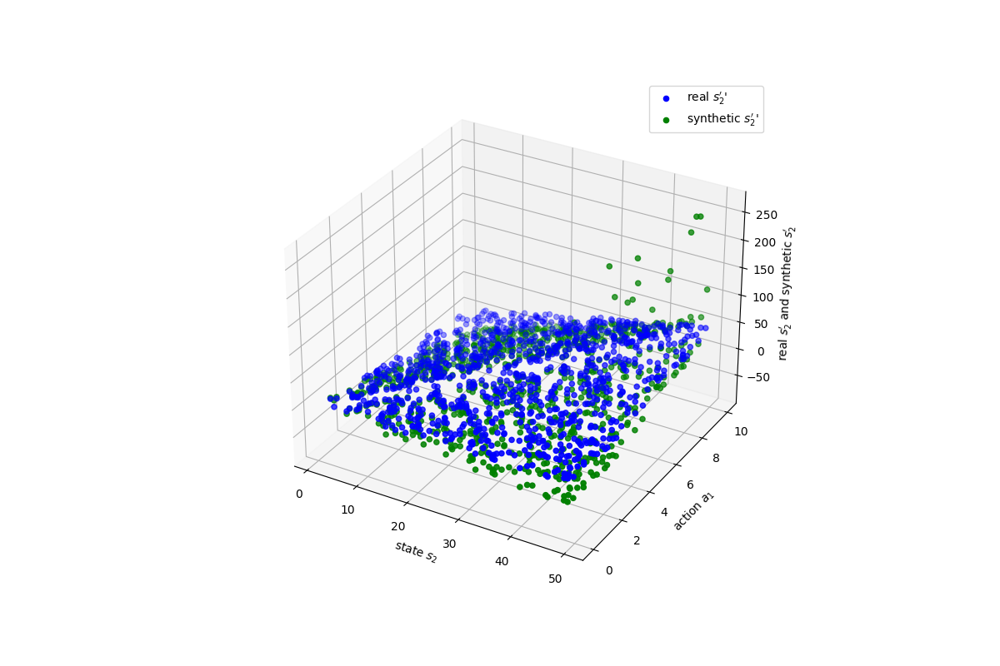
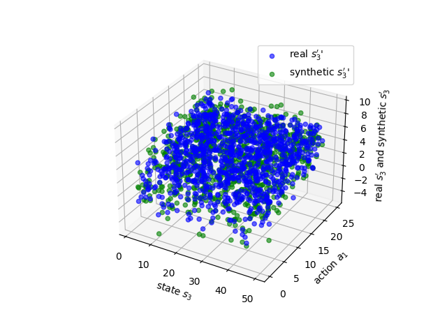
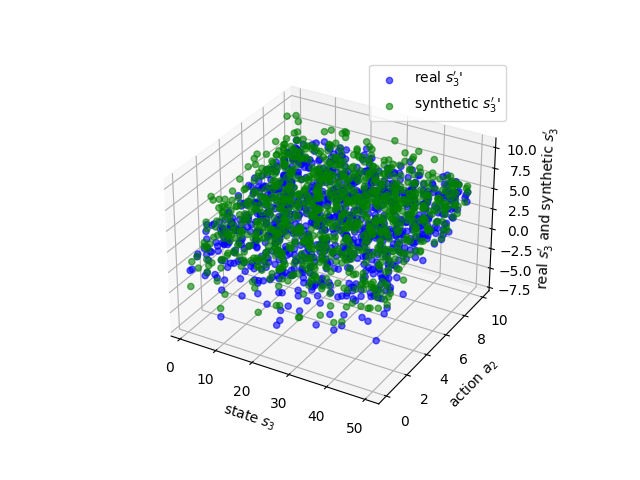
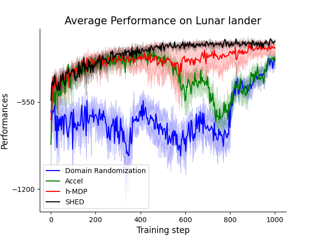
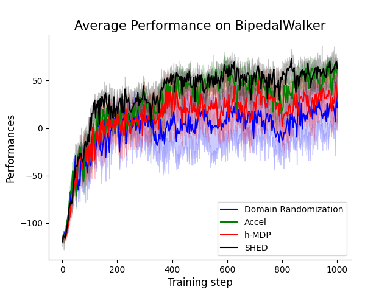

# A Hierarchical Approach to Environment Design with Generative Trajectory Modeling

  <h3 align="center">Dexun Li, Pradeep Varakantham</h3>
  

    Singapore Management University
     
    <a href="https://arxiv.org/pdf/2310.00301.pdf">[Paper]</a>
    ·
    <a href="https://github.com/LiHugh/SHED">[Codes]</a>
    
  

## 1. Abstract
Unsupervised Environment Design (UED) is a paradigm for training generally capable agents to achieve good zero-shot transfer performance. This paradigm hinges on automatically generating a curriculum of training environments. Leading approaches for UED predominantly use randomly generated environment instances to train the agent. While these methods exhibit good zero-shot transfer performance, they often encounter challenges in effectively exploring large design spaces or leveraging previously discovered underlying structures, To address these challenges, we introduce a novel framework based on Hierarchical MDP (Markov Decision Processes). Our approach includes an upper-level teacher's MDP responsible for training a lower-level MDP student agent, guided by the student's performance. To expedite the learning of the upper leavel MDP, we leverage recent advancements in generative modeling to  generate  synthetic experience dataset for training the teacher agent. Our algorithm, called Synthetically-enhanced Hierarchical Environment Design (SHED), significantly reduces the resource-intensive interactions between the agent and the environment.
To validate the effectiveness of SHED, we conduct empirical experiments across various domains, with the goal of developing an efficient and robust agent under limited training resources. Our results show the manifold advantages of SHED and highlight its effectiveness as a potent instrument for curriculum-based learning within the UED framework. This work contributes to exploring the next generation of RL agents capable of adeptly handling an ever-expanding range of complex tasks.

## 2. Background
### 2.1 Unsupervised Environment Design, UED
In UED, we train a student agent to perform well across a set of in-distribution and out-of-distribution environments. To accomplish this, UED utilizes a teacher agent that provides a sequence of environment parameter values and generates the corresponding environment to train the student to generalize well to unseen environment levels.

### 2.2 Diffusion model
In a diffusion probabilistic model, we assume a $D$-dimensional random variable $x \in R^D$ with an unknown distribution $q_0(x_0)$. Diffusion Probabilistic model involves two Markov chains: a forward chain $\displaystyle q(x_t|x_{t-1})$ that perturbs data to noise, and a reverse chain that converts noise back to data. The forward chain is typically designed to transform any data distribution into a simple prior distribution (e.g., standard Gaussian) by considering perturb data with Gaussian noise of zero mean and $\beta_t$ variance for $T$ steps:    
$$q(x_t|x_{t-1}) =  \mathcal{N} ( x_t ; \sqrt{1-\beta_t}x_{t-1} , \beta_t I) \quad q(x_{1:T}|x_{0}) = \Pi_{t=1}^T q(x_t|x_{t-1})$$

## 3. Method
our objective is to generate a sequence of environments that effectively support the continual learning of the student agent. We adopt an RL-based approach for the environment generation process.

At the core of SHED is the hierarchical MDP framework, consisting of an upper-level RL teacher policy and a lower-level student policy. 
Specifically, our framework involves specifying the upper-level teacher policy, $\Lambda:\Pi \rightarrow \Delta(\mathbb{\theta})$, where $\Pi$ represents the set of possible student policies, and $\mathbb{\theta}$ signifies the range of potential environmental parameters. Our diffusion model, denoted as $M$, may be utilized to generate synthetic teacher experiences by continually training the diffusion model on newly collected experiences. 

## 4. Experiment Domain
### 4.1 Evaluate the performance of the trajectory modelling

         

### 4.2 Two domains
we present our experimental results in the domains of BipedalWalker, Lunar Lander to demonstrate the superior performance of our approach when a trained agent is transferred to new environments.

       

## BibTeX
> @article{li2023hierarchical,  
  title={A Hierarchical Approach to Environment Design with Generative Trajectory Modeling},  
  author={Li, Dexun and Varakantham, Pradeep},  
  journal={arXiv preprint arXiv:2310.00301},  
  year={2023}  
}  

